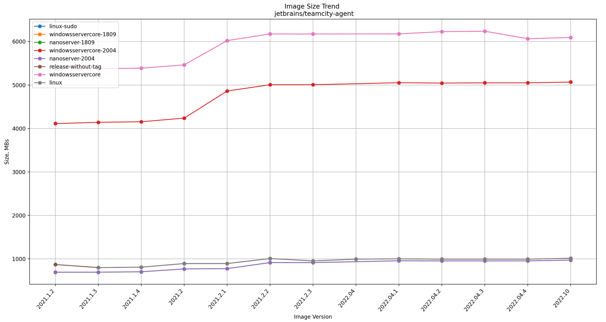

# Overview


# Visualization of Docker Image trend
Utilities dedicated for the visualization of Docker Image size trend provided in CSV format by [Automation Framework ('get-size-trend' option)](../framework).

# Available options
| Option      | Short | Type     | Description                                                                                                                                  |
|-------------|-------|----------|----------------------------------------------------------------------------------------------------------------------------------------------|
| `directory` | `-d`  | `string` | Directory with CVS files containing the trend of particular Docker Image Size. See: [Automation Framework ('get-size-trend')](../framework). |

# Requirements
* Python 3.6.0+

# Build
```
python3 -m pip install -U pip && python3 -m pip install -U matplotlib
```

# Execute
```
python3 visualize.py -d <source directory>
```